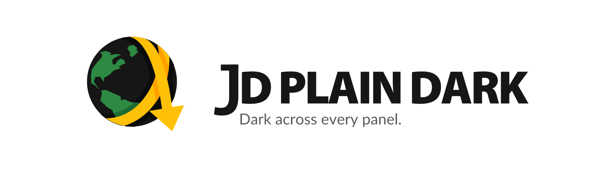
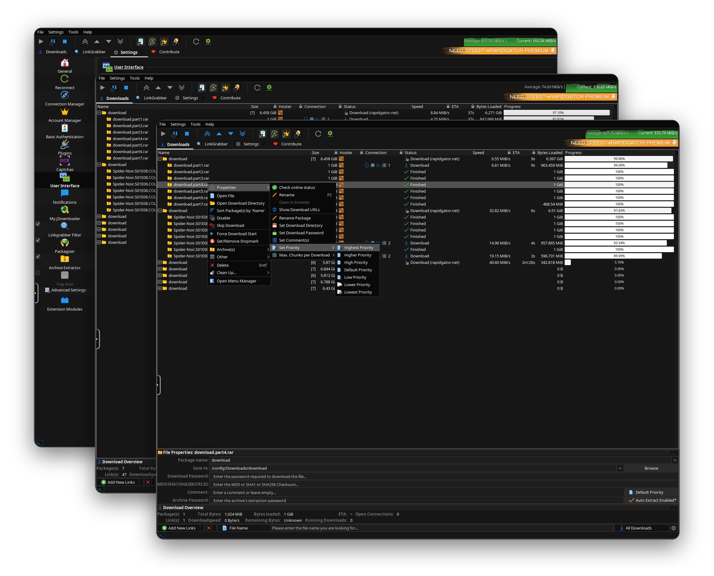

  <picture>
    <source media="(prefers-color-scheme: dark)" srcset=".github/assets/banner-dark.png">
    
  </picture>

  &nbsp;
  &nbsp;
  &nbsp;
  &nbsp;
  &nbsp;
  

 

A fully dark <b>JD Plain</b> theme for <b>JDownloader 2</b> — a monochrome IBM Carbon (#161616)
dark across the <i>whole</i> interface (download list, link grabber <b>and</b> settings, not just
the menu bar). It uses JDownloader's own colour configuration, so there is <b>no patched JAR and
no Java agent</b> — just one config file.

 

  

 

## Table of Contents

1. [What it does](#1-what-it-does)
2. [Screenshots](#2-screenshots)
3. [Install](#3-install)
4. [How it works](#4-how-it-works)
5. [Uninstall](#5-uninstall)
6. [Credits](#6-credits)
7. [Support this project](#7-support-this-project)

 

## 1. What it does

JDownloader 2 ships no proper dark mode: enable a dark Look & Feel and the *chrome*
(menu bar, toolbar, headers, scrollbars) goes dark, but JD's custom content areas — the
**download list**, the **link grabber** and the **Advanced Settings** table — stay light.

**JD Plain Dark** fixes that. It is the **JD Plain** flat icon set rendered in a neutral
IBM Carbon (`#161616`) dark, applied through the colour keys JDownloader reads itself, so the
**entire** UI is dark and consistent. Functional accents stay (green speed graph, muted
red/amber for failed downloads and accounts).

- Works on **Windows, macOS and Linux** (it is just JD config).
- **No patched `flatlaf.jar`, no Java agent** — survives JDownloader self-updates.
- **Ad-free too:** the installer also switches off JDownloader's built-in advertisements (the *"Become premium user"* banner, the premium-alert column nags, special-deal popups), so the GUI stays clean and the download graph keeps its full height. Ads only — the Donate button and all functional settings are untouched.
- One file to install, one file to remove.

 

## 2. Screenshots

  

The whole UI in monochrome IBM&nbsp;Carbon <code>#161616</code> — download list, context menu and settings.

 

## 3. Install

### Option A — download & run the installer (recommended)

1. Download `jd-plain-dark-vX.Y.Z.zip` from the [latest release](https://github.com/junkerderprovinz/jd-plain-dark/releases/latest) and unzip it.
2. Run the installer for your OS:
   - **Windows:** double-click **`install/install.bat`** (recommended). It keeps the
     window open and, if it can't find JDownloader automatically, **asks you for the
     folder**. (Right-click `install/install.ps1` → *Run with PowerShell* also works.)
   - **Linux / macOS:** `sh install/install.sh "/path/to/JDownloader"`
     (the folder that contains `cfg`). Without an argument it auto-detects, and prompts
     if it can't.
3. **Restart JDownloader.**

The installer copies `FlatDarkLaf.json` into JD's `cfg/laf/` and selects the
`FLATLAF_DARK` Look & Feel. On Windows PowerShell 5.1 it copies the file and then asks
you to pick **Settings → GUI → Look & Feel → `FLATLAF_DARK`** once.

### Option B — manual (one file)

1. Copy `theme/cfg/laf/FlatDarkLaf.json` into your JDownloader folder under `cfg/laf/`.
2. In JDownloader: **Settings → GUI → Look & Feel → `FLATLAF_DARK`**.
3. **Restart JDownloader.**

 

## 4. How it works

JDownloader stores per-Look-&-Feel colours in `cfg/laf/FlatDarkLaf.json` using `colorfor*`
keys (e.g. `colorfortablepackagerowbackground`). JD's own renderer reads these — including the
ExtTable behind the download list, link grabber and settings — so setting them dark colours the
content areas too, not only the Swing chrome. `iconsetid: flat` selects the JD Plain icons.

The installer also writes two things into `cfg/org.jdownloader.settings.GraphicalUserInterfaceSettings.json`:
`lookandfeeltheme: FLATLAF_DARK` (so the dark L&F is active) and a handful of `false` flags that
switch off JDownloader's built-in advertisements (`bannerenabled`, the `premiumalert*` columns,
`specialdeals*`, the status-bar premium button). Ads only — nothing functional is changed.

That is the whole trick: no bytecode patching, no `-javaagent`. Because it is plain
configuration, JD's automatic updates don't break it.

 

## 5. Uninstall

Delete `cfg/laf/FlatDarkLaf.json` from your JDownloader folder and pick another Look & Feel
under **Settings → GUI → Look & Feel**, then restart JDownloader.

 

## 6. Credits

The technique — overriding JDownloader's native `colorfor*` colour config to reach the content
areas — was inspired by the community **Material Darker** theme. The colours here are our own
(IBM Carbon monochrome) and no Material Darker code or assets are included. Licensed MIT.

Derived from the dark theme built into the [JDownloader-for-Unraid container](https://github.com/junkerderprovinz/jdownloader).

 

## 7. Support this project

If this saved you some squinting, you can

Issues and suggestions: [GitHub Issues](https://github.com/junkerderprovinz/jd-plain-dark/issues).
